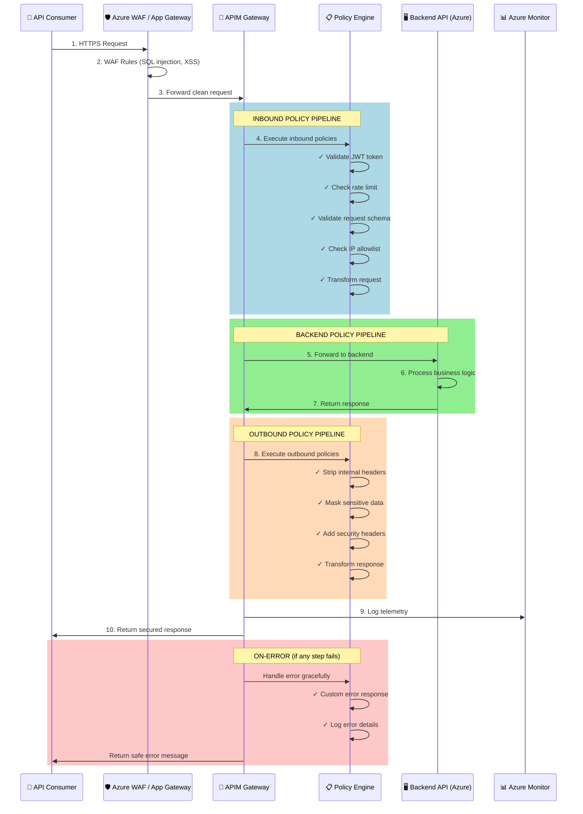
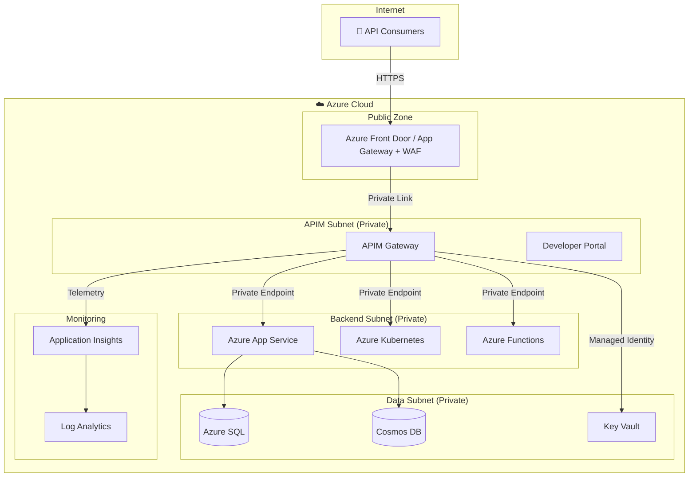

# Azure API Management — End-to-End Architecture

## Overview

Azure API Management (APIM) is a fully managed service that enables organizations to publish, secure, transform, maintain, and monitor APIs. It acts as a **reverse proxy** (API Gateway) sitting between API consumers and backend services.

## Core Components

```
┌─────────────────────────────────────────────────────────────────────┐
│                    Azure API Management                             │
│                                                                     │
│  ┌──────────────┐  ┌──────────────────┐  ┌───────────────────────┐ │
│  │  Developer    │  │  API Gateway     │  │  Management Plane     │ │
│  │  Portal       │  │  (Data Plane)    │  │  (Azure Portal/API)   │ │
│  │              │  │                  │  │                       │ │
│  │  - API docs  │  │  - Request proxy │  │  - API configuration  │ │
│  │  - Try-it    │  │  - Policy engine │  │  - User management    │ │
│  │  - Sign-up   │  │  - Caching       │  │  - Analytics          │ │
│  │  - API keys  │  │  - Logging       │  │  - Policy authoring   │ │
│  └──────────────┘  └──────────────────┘  └───────────────────────┘ │
└─────────────────────────────────────────────────────────────────────┘
```

### 1. API Gateway (Data Plane)
The gateway is where all API calls flow through. It:
- Receives incoming HTTP/HTTPS requests
- Applies **inbound policies** (authentication, rate limiting, transformation)
- Forwards requests to the **backend service**
- Applies **outbound policies** (response transformation, header manipulation)
- Returns the response to the caller

### 2. Management Plane
The Azure Portal (or REST API / Bicep / Terraform) is used to:
- Define APIs (OpenAPI, WSDL, GraphQL)
- Configure policies
- Manage products, subscriptions, and users
- View analytics and diagnostics

### 3. Developer Portal
A customizable website where API consumers can:
- Discover and explore APIs
- Generate subscription keys
- Test API calls interactively

---

## End-to-End Request Flow



### Step-by-Step Breakdown

| Step | What Happens | Where |
|------|-------------|-------|
| 1 | Client sends HTTPS request to API endpoint | Internet → Azure |
| 2 | Azure WAF/Application Gateway inspects for L7 attacks (SQLi, XSS, bot patterns) | Edge |
| 3 | Clean request forwarded to APIM gateway | Azure network |
| 4 | **Inbound policies** execute: JWT validation, rate limiting, IP checks, schema validation | APIM Gateway |
| 5 | Request forwarded to backend (private endpoint, managed identity auth) | APIM → Backend |
| 6 | Backend processes business logic | App Service / AKS / Functions |
| 7 | Backend returns response | Backend → APIM |
| 8 | **Outbound policies** execute: strip headers, mask PII, add CORS/security headers | APIM Gateway |
| 9 | Telemetry logged to Azure Monitor / Application Insights | Monitoring |
| 10 | Secured, transformed response returned to client | APIM → Client |

---

## Network Architecture



### Key Security Architecture Decisions

1. **APIM in Internal Mode**: Gateway only accessible via private IP; public traffic routed through App Gateway/WAF
2. **Private Endpoints**: Backend services never exposed publicly; connected via Azure Private Link
3. **Managed Identity**: APIM authenticates to Key Vault and backends using managed identity (no stored credentials)
4. **Network Segmentation**: Separate subnets for APIM, backends, and data tiers
5. **TLS Everywhere**: End-to-end encryption, minimum TLS 1.2

---

## APIM Tiers and Deployment Options

| Tier | Use Case | SLA | Gateway Locations |
|------|----------|-----|-------------------|
| **Consumption** | Serverless, pay-per-call | 99.95% | Single region |
| **Developer** | Dev/test (no SLA) | None | Single region |
| **Basic** | Entry-level production | 99.95% | Single region |
| **Standard** | Production workloads | 99.95% | Single region |
| **Premium** | Enterprise, multi-region | 99.99% | Multi-region |
| **v2 Tiers** | Next-gen, faster provisioning | 99.95%+ | Flexible |

---

## What Makes APIM the Security Control Plane

APIM is not just a proxy — it's a **programmable security boundary**:

1. **Authentication Gateway**: Validates OAuth 2.0/JWT tokens before requests reach backends
2. **Rate Limiter**: Prevents DDoS and abuse with configurable throttling
3. **Schema Validator**: Rejects malformed requests at the edge
4. **Data Masker**: Strips sensitive data from responses before reaching consumers
5. **Audit Trail**: Every API call logged with caller identity, timing, and response codes
6. **Policy Engine**: Turing-complete policy expressions for custom security logic

> **Key Insight**: By enforcing security at the APIM layer, backends can focus on business logic without reimplementing auth, throttling, or input validation.

---

*Next: [Policy Pipeline Deep-Dive →](02-policy-pipeline.md)*
