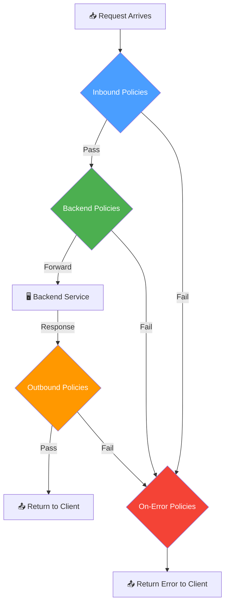
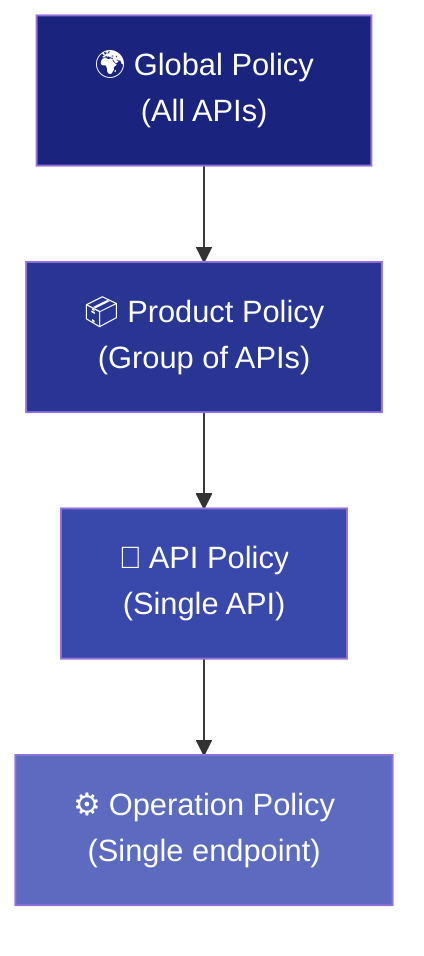

# APIM Policy Pipeline — Deep Dive

## How Policies Work

Policies are **XML-based configuration statements** that run sequentially during API request/response processing. They are the core mechanism for implementing security, transformation, and control logic in APIM.

## The Four Policy Sections

Every APIM policy has four sections that execute in order:

```xml
<policies>
    <!-- 1. INBOUND: Runs when request arrives at gateway -->
    <inbound>
        <base />
        <!-- Authentication, rate limiting, validation, transformation -->
    </inbound>

    <!-- 2. BACKEND: Controls how request is forwarded -->
    <backend>
        <base />
        <!-- Set backend URL, add credentials, retry logic -->
    </backend>

    <!-- 3. OUTBOUND: Runs before response is sent to caller -->
    <outbound>
        <base />
        <!-- Strip headers, mask data, transform response -->
    </outbound>

    <!-- 4. ON-ERROR: Runs if any pipeline stage fails -->
    <on-error>
        <base />
        <!-- Custom error responses, logging, fallback -->
    </on-error>
</policies>
```

## Policy Execution Flow



---

## Policy Scoping (Inheritance)

Policies can be applied at four levels, from broadest to most specific:



### How `<base />` Works
The `<base />` element controls **where parent policies execute** relative to the current scope:

```xml
<!-- API-level policy -->
<inbound>
    <!-- Global policies run FIRST (via <base />) -->
    <base />
    
    <!-- Then API-specific policies run -->
    <set-header name="X-API-Version" exists-action="override">
        <value>2.0</value>
    </set-header>
</inbound>
```

**Placement matters:**
- `<base />` at **top** → parent runs first, then current
- `<base />` at **bottom** → current runs first, then parent
- **No** `<base />` → parent policies are **skipped** (use carefully!)

---

## Inbound Policy Examples

### 1. JWT Token Validation (OAuth 2.0)
```xml
<inbound>
    <validate-jwt header-name="Authorization" 
                  failed-validation-httpcode="401"
                  failed-validation-error-message="Unauthorized. Token is invalid or expired."
                  require-expiration-time="true"
                  require-signed-tokens="true">
        <openid-config url="https://login.microsoftonline.com/{tenant-id}/v2.0/.well-known/openid-configuration" />
        <required-claims>
            <claim name="aud" match="any">
                <value>{api-client-id}</value>
            </claim>
            <claim name="roles" match="any">
                <value>API.Read</value>
                <value>API.Write</value>
            </claim>
        </required-claims>
    </validate-jwt>
</inbound>
```

### 2. Rate Limiting
```xml
<inbound>
    <!-- Per-subscription rate limiting -->
    <rate-limit-by-key calls="100" 
                       renewal-period="60" 
                       counter-key="@(context.Subscription.Id)" />
    
    <!-- Global quota -->
    <quota-by-key calls="10000" 
                  renewal-period="86400" 
                  counter-key="@(context.Subscription.Id)" />
</inbound>
```

### 3. IP Filtering
```xml
<inbound>
    <ip-filter action="allow">
        <address-range from="10.0.0.0" to="10.0.0.255" />
        <address>203.0.113.50</address>
    </ip-filter>
</inbound>
```

### 4. Request Body Validation
```xml
<inbound>
    <validate-content unspecified-content-type-action="prevent"
                      max-size="102400"
                      size-exceeded-action="prevent"
                      errors-variable-name="validationErrors">
        <content type="application/json" validate-as="json" 
                 action="prevent" />
    </validate-content>
</inbound>
```

---

## Backend Policy Examples

### 1. Set Backend URL Dynamically
```xml
<backend>
    <set-backend-service base-url="https://my-api.azurewebsites.net" />
</backend>
```

### 2. Authentication with Managed Identity
```xml
<backend>
    <authentication-managed-identity resource="https://my-api.azurewebsites.net" />
</backend>
```

### 3. Retry on Failure
```xml
<backend>
    <retry condition="@(context.Response.StatusCode == 503)" 
           count="3" 
           interval="2" 
           first-fast-retry="true">
        <forward-request />
    </retry>
</backend>
```

---

## Outbound Policy Examples

### 1. Strip Sensitive Headers
```xml
<outbound>
    <set-header name="X-Powered-By" exists-action="delete" />
    <set-header name="X-AspNet-Version" exists-action="delete" />
    <set-header name="Server" exists-action="delete" />
    <set-header name="X-Request-Id" exists-action="override">
        <value>@(context.RequestId.ToString())</value>
    </set-header>
</outbound>
```

### 2. Add Security Headers
```xml
<outbound>
    <set-header name="X-Content-Type-Options" exists-action="override">
        <value>nosniff</value>
    </set-header>
    <set-header name="X-Frame-Options" exists-action="override">
        <value>DENY</value>
    </set-header>
    <set-header name="Content-Security-Policy" exists-action="override">
        <value>default-src 'none'</value>
    </set-header>
    <set-header name="Strict-Transport-Security" exists-action="override">
        <value>max-age=31536000; includeSubDomains</value>
    </set-header>
</outbound>
```

### 3. Mask Sensitive Data in Response
```xml
<outbound>
    <find-and-replace from="\"ssn\":\"[0-9]{3}-[0-9]{2}-[0-9]{4}\"" 
                      to="\"ssn\":\"***-**-****\"" />
    <find-and-replace from="\"creditCard\":\"[0-9]{16}\"" 
                      to="\"creditCard\":\"****-****-****-****\"" />
</outbound>
```

---

## On-Error Policy Examples

### Custom Error Response
```xml
<on-error>
    <!-- Log the error -->
    <trace source="Error Handler" severity="error">
        <message>@($"Error: {context.LastError.Message}, Reason: {context.LastError.Reason}")</message>
    </trace>
    
    <!-- Return a safe error response (no stack traces) -->
    <return-response>
        <set-status code="500" reason="Internal Server Error" />
        <set-header name="Content-Type" exists-action="override">
            <value>application/json</value>
        </set-header>
        <set-body>@{
            return new JObject(
                new JProperty("error", "An error occurred processing your request"),
                new JProperty("requestId", context.RequestId.ToString()),
                new JProperty("timestamp", DateTime.UtcNow.ToString("o"))
            ).ToString();
        }</set-body>
    </return-response>
</on-error>
```

---

## Policy Expressions (C# Inline Code)

APIM policies support **C# expressions** for dynamic behavior:

```xml
<!-- Conditional logic -->
<choose>
    <when condition="@(context.Request.Headers.GetValueOrDefault("X-Environment","") == "production")">
        <rate-limit-by-key calls="50" renewal-period="60" 
                           counter-key="@(context.Subscription.Id)" />
    </when>
    <otherwise>
        <rate-limit-by-key calls="500" renewal-period="60" 
                           counter-key="@(context.Subscription.Id)" />
    </otherwise>
</choose>
```

```xml
<!-- Access request/response data -->
<set-header name="X-User-Email" exists-action="override">
    <value>@{
        var jwt = context.Request.Headers.GetValueOrDefault("Authorization","")
                    .Replace("Bearer ","");
        var claims = jwt.AsJwt()?.Claims;
        return claims?.GetValueOrDefault("email", "unknown") ?? "unknown";
    }</value>
</set-header>
```

---

## Policy Fragments (Reusable Snippets)

Policy fragments let you define reusable policy blocks:

```xml
<!-- Define fragment -->
<fragment>
    <set-header name="X-Content-Type-Options" exists-action="override">
        <value>nosniff</value>
    </set-header>
    <set-header name="X-Frame-Options" exists-action="override">
        <value>DENY</value>
    </set-header>
</fragment>
```

```xml
<!-- Use fragment in any policy -->
<outbound>
    <include-fragment fragment-id="security-headers" />
    <base />
</outbound>
```

> **Best Practice**: Use fragments for cross-cutting concerns like security headers, logging, and authentication. Manage them as code in your Git repository.

---

*Previous: [← APIM Architecture](01-apim-architecture.md) | Next: [OWASP API Top 10 →](03-owasp-api-top10.md)*
