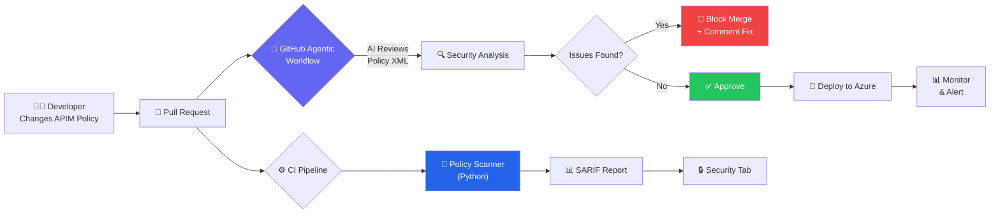
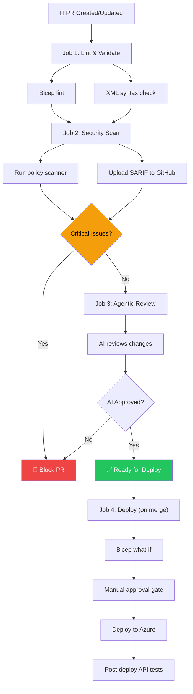
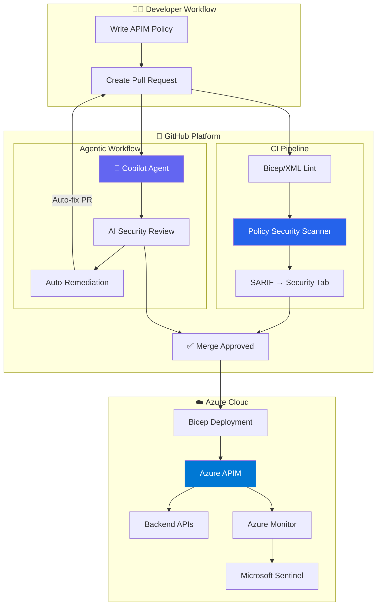

# Security Automation with GitHub Agentic Workflows

## The Problem: Policy Drift & Human Error

APIM policies are powerful — but they're also **XML configuration that can be misconfigured**. Common issues:

- Developer removes `validate-jwt` to "speed up testing" and forgets to re-add it
- CORS policy set to `*` (allow all origins) reaches production  
- Rate limiting thresholds set too high or removed entirely
- Internal headers not stripped from responses
- New API operations deployed without authentication policies

**These are not hypothetical risks** — they're the most common causes of API breaches.

## The Solution: Automated Security Guardrails



## Three Layers of Protection

### Layer 1: GitHub Agentic Workflow (AI-Powered Review)

GitHub Agentic Workflows use **AI coding agents** (like Copilot) to perform intelligent, context-aware code review. Unlike static rules, the AI understands the **intent** of a policy change and can catch subtle security issues.

**What it does:**
- Reviews every PR that touches `policies/` or `infra/` files
- Understands OWASP API Top 10 in context
- Explains *why* a change is risky, not just *that* it fails a rule
- Suggests specific fixes with corrected XML
- Can auto-remediate simple issues (like missing security headers)

**Example: AI catches a dangerous CORS change**
```
🤖 Copilot Security Review

⚠️ CRITICAL: CORS policy allows all origins

File: policies/api-level-policy.xml, Line 12
- <cors allow-credentials="true">
-     <allowed-origins><origin>*</origin></allowed-origins>
+ <cors allow-credentials="true">
+     <allowed-origins>
+         <origin>https://app.contoso.com</origin>
+         <origin>https://portal.contoso.com</origin>
+     </allowed-origins>

Reason: Wildcard CORS with allow-credentials=true allows any website 
to make authenticated requests to your API (OWASP API8: Security 
Misconfiguration). Restrict to known origins.
```

### Layer 2: Policy Security Scanner (Deterministic Rules)

A Python-based scanner runs in CI and checks policies against a defined rule set:

| Rule Category | What It Checks |
|--------------|----------------|
| **Authentication** | JWT validation present, signed tokens required, expiration enforced |
| **Rate Limiting** | Rate limits and quotas defined, thresholds within safe ranges |
| **CORS** | No wildcard origins, credentials only with explicit origins |
| **Headers** | Security headers present in outbound, internal headers stripped |
| **Data Protection** | Sensitive data masked, response body sanitized |
| **Error Handling** | On-error section present, no stack traces in error responses |
| **Network** | Backend URLs use HTTPS, no references to internal IPs |
| **HTTP Methods** | Dangerous methods (TRACE, CONNECT) blocked |

The scanner outputs results in **SARIF format**, which integrates with GitHub's Security tab for a unified view of all findings.

### Layer 3: CI/CD Pipeline with Security Gates



## How GitHub Agentic Workflows Differ from Traditional CI

| Aspect | Traditional CI (YAML) | Agentic Workflow (AI) |
|--------|----------------------|----------------------|
| **Definition** | Imperative YAML steps | Declarative Markdown intent |
| **Intelligence** | Pattern matching (regex) | Contextual understanding |
| **False Positives** | Many (rigid rules) | Few (AI understands context) |
| **Remediation** | Manual fix | Auto-suggested or auto-applied |
| **New Threats** | Requires new rules | AI adapts with knowledge |
| **Explainability** | "Rule X failed" | "This is dangerous because..." |

## What Makes This Microsoft's Advantage

1. **Azure APIM**: Enterprise API gateway with the richest policy engine in the market
2. **GitHub Actions**: Industry-leading CI/CD platform with native security features
3. **GitHub Copilot**: The most widely adopted AI coding assistant
4. **Agentic Workflows**: Unique to GitHub — AI agents that autonomously review and protect
5. **End-to-End Integration**: APIM → GitHub → Copilot → Azure Monitor — no third-party tools needed

> **The pitch**: "With Microsoft, your API security is automated from code to cloud. Every policy change is AI-reviewed, every deployment is scanned, and every runtime anomaly is monitored. No other vendor offers this level of integration."

---

## Architecture: End-to-End Security Automation



---

*Previous: [← OWASP API Top 10](03-owasp-api-top10.md) | Next: [Demo Walkthrough →](05-demo-walkthrough.md)*
